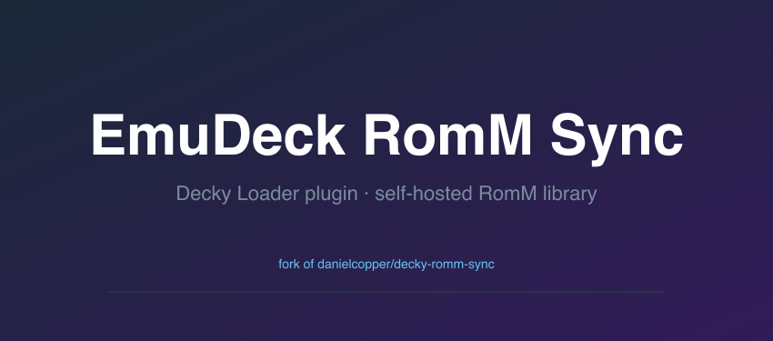
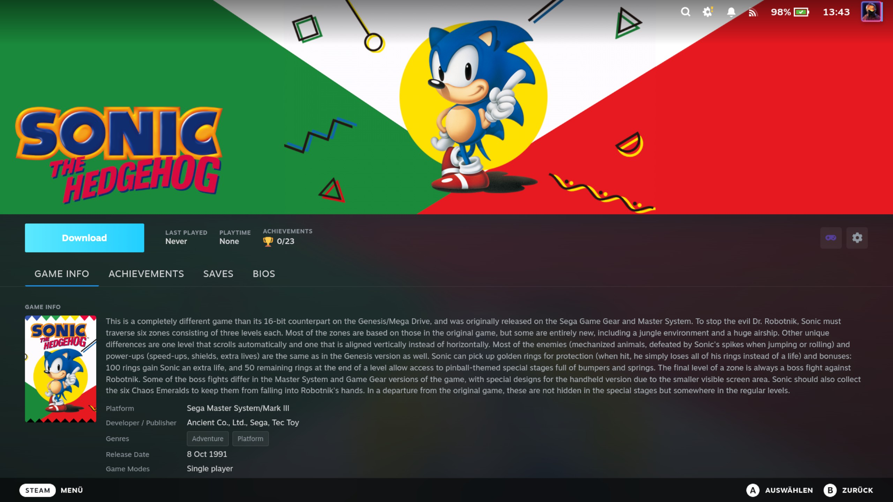
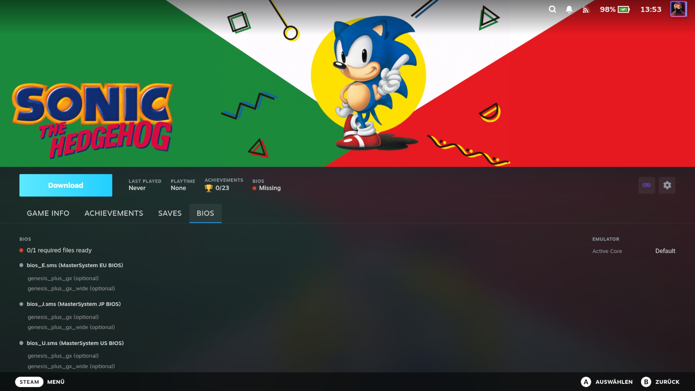
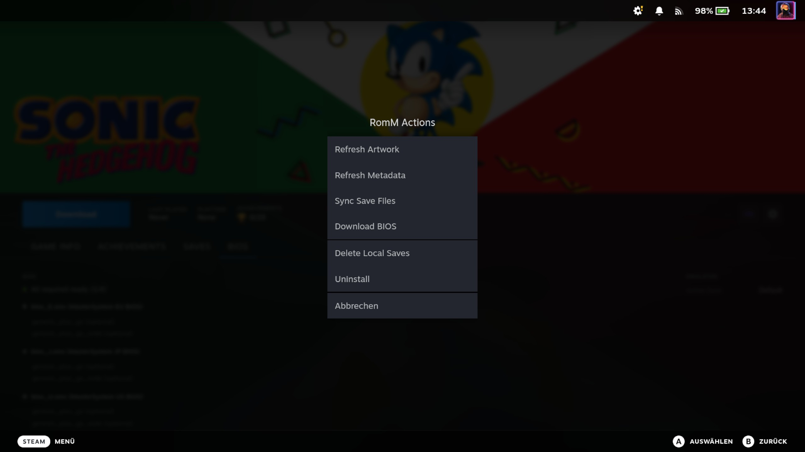

# decky-romm-sync

A [Decky Loader](https://decky.xyz/) plugin that syncs your self-hosted [RomM](https://github.com/rommapp/romm) library
into Steam as non-steam shortcuts. Games appear directly in your Steam library, launch through
[RetroDECK](https://retrodeck.net/), and keep their saves in sync across devices through your RomM server.

## 📖 [Read the full documentation →](https://danielcopper.github.io/decky-romm-sync/)

Installation, setup, save sync, BIOS management, troubleshooting, and the architecture reference all live on the
documentation site. This README is just the quick tour.

## Features

- **Library sync** — Pulls platforms and ROMs from your RomM server and creates Steam shortcuts, complete with cover
  art, hero banners, and logos (with optional [SteamGridDB](https://www.steamgriddb.com/) artwork)
- **Save sync** — Keeps save files in sync across devices through your RomM server, with newest-wins conflict
  resolution and a manual override when you need it
- **ROM downloads** — Download ROMs on demand with progress tracking and a managed download queue
- **BIOS management** — Download firmware/BIOS files from RomM for systems that need them (PSX, Dreamcast, PS2, …)
- **Game detail page** — Install status, BIOS status, and download/uninstall actions right on each game's Steam page
- **Per-platform control** — Choose exactly which platforms get synced
- **Controller friendly** — Full gamepad navigation throughout the plugin UI
- **Steam Input config** — Per-shortcut Steam Input mode (Default / Force On / Force Off)
- **RetroDECK path migration** — Move your RetroDECK installation between storage locations without re-syncing
- **RetroArch diagnostics** — Detects misconfigured input drivers that break menu navigation

## Screenshots

| QAM panel | Game detail page |
| :---: | :---: |
|  |  |
| **BIOS management** | **Per-game actions** |
|  |  |

## Requirements

- [Decky Loader](https://decky.xyz/) on your Steam Deck or Linux HTPC
- A running [RomM](https://github.com/rommapp/romm) server, **version 4.8.1 or newer** (the plugin stays inert against
  older servers)
- [RetroDECK](https://retrodeck.net/) for launching games

## Installation

### From the Decky Store

> ⚠️ **Not available yet.** The plugin will be submitted to the [Decky Store](https://plugins.deckbrew.xyz/) with the
> **v1.0** release. Until then, use the manual install below.

Once published, install it straight from Decky's built-in store — open the Quick Access Menu → **Decky** → store icon,
search for **RomM Sync**, and install. No Developer Mode required.

### From ZIP or URL

This is the current method while v1.0 is in progress. It requires **Developer Mode** in Decky Loader (Decky settings →
gear icon → toggle **Developer Mode**).

1. Download the latest `decky-romm-sync.zip` from the [releases page](https://github.com/danielcopper/decky-romm-sync/releases)
2. In Decky settings → **Developer** tab → **Install Plugin from ZIP** (or **from URL** with the
   [latest release link](https://github.com/danielcopper/decky-romm-sync/releases/latest/download/decky-romm-sync.zip))

> Full step-by-step instructions, including first-time setup, are in
> [Getting Started](https://danielcopper.github.io/decky-romm-sync/user-guide/getting-started/).

## Quick start

1. Open the Quick Access Menu and select **RomM Sync**
2. In **Settings**, enter your RomM server URL and credentials, then hit **Test Connection**
3. In **Platforms**, enable the platforms you want to sync
4. Hit **Sync Library** — your ROMs appear as non-steam shortcuts

See the [User Guide](https://danielcopper.github.io/decky-romm-sync/user-guide/syncing-your-library/) for syncing
details, [save sync](https://danielcopper.github.io/decky-romm-sync/user-guide/save-sync/), and
[BIOS management](https://danielcopper.github.io/decky-romm-sync/user-guide/bios-management/).

## Contributing

Build from source, run the tests, and read the architecture reference on the documentation site:

- [Development setup](https://danielcopper.github.io/decky-romm-sync/contributing/development/)
- [Backend architecture](https://danielcopper.github.io/decky-romm-sync/architecture/backend-architecture/)

## Acknowledgments

This plugin stands on the shoulders of some great projects:

- [RomM](https://github.com/rommapp/romm) — the self-hosted ROM manager at the heart of this plugin. RomM provides
  the library, metadata, cover art, and save file storage that makes the entire sync experience possible
- [RetroDECK](https://retrodeck.net/) — the all-in-one emulation solution for Steam Deck that bundles ES-DE,
  RetroArch, and standalone emulators into a single flatpak. Our entire launch chain runs through RetroDECK
- [Decky Loader](https://decky.xyz/) — the plugin framework that makes all of this possible
- [Valve](https://www.valvesoftware.com/) — for the Steam Deck, SteamOS, and an open enough platform to build on
- [Unifideck](https://github.com/ma3ke/unifideck) — inspiration for game detail page injection techniques and gamepad
  navigation patterns
- [MetaDeck](https://github.com/EmuDeck/MetaDeck) — inspiration for store patching patterns used in metadata display
  on non-Steam shortcuts

## License

GPL-3.0
