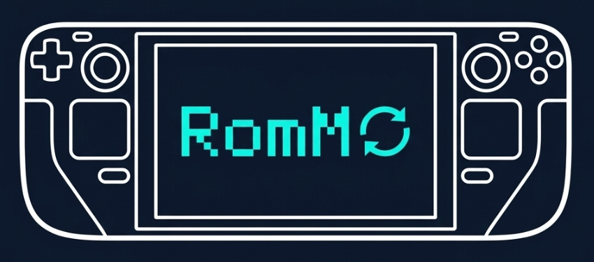

# EmuDeck RomM Sync

> **EmuDeck-focused fork** of [danielcopper/decky-romm-sync](https://github.com/danielcopper/decky-romm-sync). Today
> the plugin still ships identical to upstream's behaviour; the EmuDeck-specific changes are landing in phases — see
> the project [README](https://github.com/chenasraf/decky-emudeck-romm#roadmap) for the roadmap.

A [Decky Loader](https://decky.xyz/) plugin that syncs your self-hosted [RomM](https://github.com/rommapp/romm) ROM
library into your Steam Deck. Browse and download ROMs from the QAM, manage BIOS files, keep saves in sync, and
launch through your emulation frontend — [RetroDECK](https://retrodeck.net/) today;
[EmuDeck](https://www.emudeck.com/) support is the target of the rewrite.

- Browse your entire RomM library directly from Steam's Gaming Mode
- Download ROMs on-demand with cover art, hero banners, logos, and metadata
- Manage BIOS files for systems that require them
- Sync save files between devices through your RomM server

## User Guide

1. **[Getting Started](user-guide/getting-started.md)** — Prerequisites, installation, and first-time setup
2. **[Configuration](user-guide/configuration.md)** — Connection settings, SteamGridDB API key, Steam Input, debug options
3. **[Syncing Your Library](user-guide/syncing-your-library.md)** — How sync works, per-platform toggles, collections, artwork
4. **[Managing Games](user-guide/managing-games.md)** — Game detail panel, downloading ROMs, uninstalling, refreshing metadata
5. **[BIOS Management](user-guide/bios-management.md)** — What BIOS files are, checking status, downloading per-platform
6. **[RetroDECK Path Migration](user-guide/retrodeck-path-migration.md)** — Moving your RetroDECK installation between storage locations
7. **[Save Sync](user-guide/save-sync.md)** — Auto-sync, conflict resolution modes, manual sync, failed sync retries
8. **[Troubleshooting](user-guide/troubleshooting.md)** — Common issues, fixes, Danger Zone explained

## Technical Reference

Developer-oriented documentation for contributors and those interested in the internals.

- **[Steam Non-Steam Shortcuts](architecture/steam-non-steam-shortcuts.md)** — AddShortcut API, VDF format, app ID generation
- **[Backend Architecture](architecture/backend-architecture.md)** — Service/adapter architecture, dependency diagram, boundary enforcement
- **[Config Source Parsers](architecture/config-source-parsers.md)** — One-parser-per-source principle, source catalog, parser layout template for local config/metadata files
- **[Development](contributing/development.md)** — Developer setup, building, testing, dev reload
- **[Save File Sync Architecture](architecture/save-file-sync-architecture.md)** — Three-way conflict detection, session tracking, state schema, device registration
- **[Steam Remote Play and Cross-Device Shortcuts](architecture/steam-remote-play.md)** — Remote Play discovery protocol, phantom shortcuts, detection APIs
